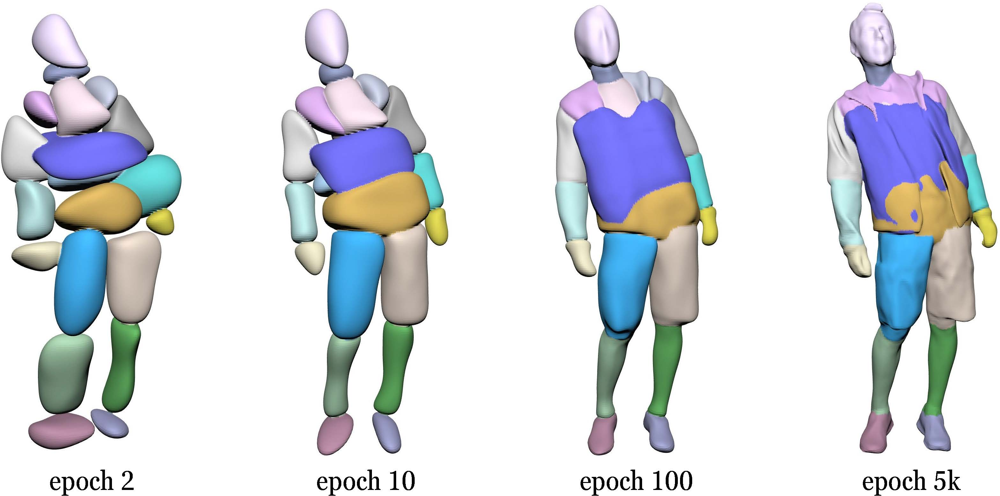

# UNIF

[ECCV-2022] The official repo for the  paper "UNIF: United Neural Implicit Functions for Clothed Human Reconstruction and Animation".

[project](https://shenhanqian.github.io/unif) / [arxiv](https://arxiv.org/abs/2207.09835) / [video](https://shenhanqian.com/unif) / [poster](http://127.0.0.1:4000/assets/2022-07-18-unif/poster.pdf)



Checkpoints and logs can be downloaded [here](https://shanghaitecheducn-my.sharepoint.com/:f:/g/personal/qianshh_shanghaitech_edu_cn/EttsABBO8jFNqDucxlcyE_wB6XkaYZ6Xt5OMYOGaJjVxWA?e=2vMhxD).

## Installation

### 1. Install PyTorch, CUDA runtime in a conda environment

```
# Create a new virtual environment with conda
conda create --name UNIF python=3.9

# Install PyTorch along with CUDA runtime
conda install cudatoolkit=11.3 pytorch=1.12.0 -c pytorch
```

### 2. Install Pytorch3D

You can either install from prebuilt from binaries

```
# install with conda
conda install pytorch3d -c pytorch3d
```

or install from source

```
# runtime dependencies
conda install -c fvcore -c iopath -c conda-forge fvcore iopath

# build time dependency
conda install -c bottler nvidiacub

# building from source
pip install "git+https://github.com/facebookresearch/pytorch3d.git"
```

You can refer to the official [doc](https://github.com/facebookresearch/pytorch3d/blob/main/INSTALL.md) in case that problems occur.

### 3. Install other dependencies

```
pip install -r requirements.txt

# We use `mise` from *Occupancy Networks* to speed up mesh generation with adaptive point inferencing. This package can be automatically configured by running
pip install -e .

# To use the offscreen render of `PyRender`, set the environmental variable:
export PYOPENGL_PLATFORM=egl
```

## Data

### SMPL

Download SMPL-1.0.0 from the [homepage](https://smpl.is.tue.mpg.de/), extract it, and put `basicModel_f_lbs_10_207_0_v1.0.0.pkl` and `basicmodel_m_lbs_10_207_0_v1.0.0.pkl` under `./data/smpl/models/`.

### CAPE

The CAPE dataset can be downloaded from the [homepage](https://cape.is.tue.mpg.de/).

1. Follow the **Option 2: Download by subject** section in the **Download** page. Download per-subject mesh data for `00032`, `00096`, `00159`, and `03223`, as only these four subjects have raw scans released.
2. Follow the **Raw Scans** section in the **Download** page, and download per-subject scan data into `./data/cape_release/raw_scans`
3. The dataset does not provide the shape parameters (beta) for each subject. You can download the beta parameters fitted by us from this OneDrive [link](https://shanghaitecheducn-my.sharepoint.com/:f:/g/personal/qianshh_shanghaitech_edu_cn/EttsABBO8jFNqDucxlcyE_wB6XkaYZ6Xt5OMYOGaJjVxWA?e=s9jpmn). You can also refer to [this](./CAPE-beta.md) document to fit SMPL parameters within our framework.

### ClothSeq

1. Download the dataset from the [Neural-GIF](https://github.com/garvita-tiwari/neuralgif) repo. Arrange the files under `./data/ClothSeq/`.
2. The scale of raws scans of the `ShrugsPants` sequence is 1000 times larger than the other two. Therefore, we scale it down with the following command:

```
mv data/ClothSeq/ShrugsPants/scans data/ClothSeq/ShrugsPants/scans_old
mkdir data/ClothSeq/ShrugsPants/scans
./tools/clothseq_clean.py data/ClothSeq/ShrugsPants/scans_old data/ClothSeq/ShrugsPants/scans
```

3. Since the `.obj` files are slow to load, we transform them into `.ply` files by

```
python tools/obj2ply.py data/ClothSeq/JacketPants/scans data/ClothSeq/JacketPants/scans-ply
```

## Experiments

### CAPE (raw scans)

Train and validation (unseen poses)

```shell
python main.py --cfg config/cape-scan-subject-cloth_unif.py \
EXP.tag 00032_SS_SCAN_UNIF-20_APS-alpha2beta0_deltaSoftMin200 \
DATASET.kwargs.subject_name 00032 \
DATASET.kwargs.cloth_type shortshort \
```

To test on extrapolated poses for metrics and partial visual results, add the arguments

```shell
...
EXP.test_only True \
EXP.checkpoint <ckpt-path> \
```

To test on interpolated poses, further add the argument

```shell
...
DATASET.kwargs.test_interpolation True \
```

If you only need the visual results (without metrics and losses), then you can save computation by adding the argument

```shell
...
EXP.TEST.external_query True \
```

To save all results in each batch, add the argument

```shell
...
EXP.TEST.save_all_results True \
```

### ClothSeq (raw scans)

```shell
python main.py --cfg config/clothseq_frames_unif.py \
EXP.tag JacketShorts_SCAN_UNIF-20_APS-alpha2beta0_deltaSoftMin200 \
DATASET.kwargs.clip_name JacketShorts \
```

## Troubleshooting

- ImportError: ('Unable to load EGL library', 'EGL: cannot open shared object file: No such file or directory', 'EGL', None)

``` shell
sudo apt install libosmesa6-dev freeglut3-dev
```

## Cite

```
@inproceedings{qian2022unif,
  title={UNIF: United Neural Implicit Functions for Clothed Human Reconstruction and Animation},
  author={Qian, Shenhan and Xu, Jiale and Liu, Ziwei and Ma, Liqian and Gao, Shenghua},
  booktitle={European Conference on Computer Vision},
  pages={121--137},
  year={2022},
  organization={Springer}
}
```
